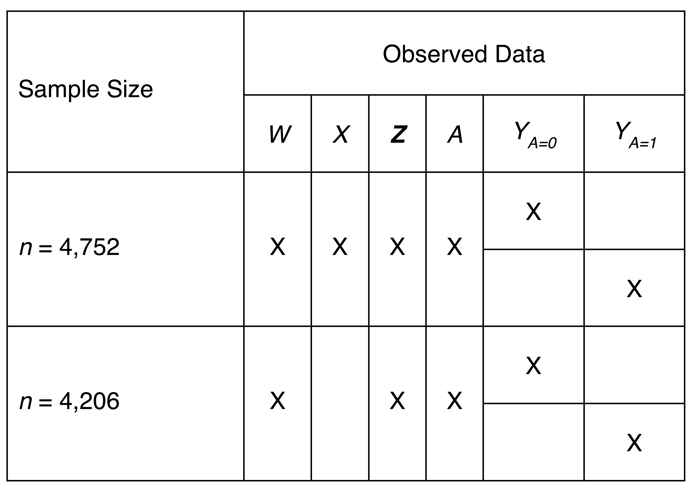
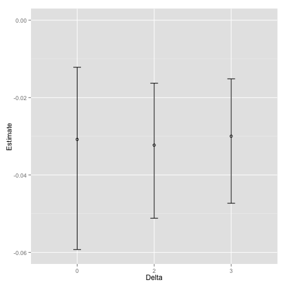

## Bayesian approach for addressing covariate measurement error in propensity score methods
 
 

### Elizabeth Stuart

and [insert other folks here]

 
 
 

Grant #123

Note: 

---

## Agenda
 

1. Background
	* Motivation
	* Previous Research
	* Goal
2. Methods
	* Notation
	* Estimands and Estimators
	* Simulation Set-Up
3. Results
	* Simulation
	* Illustrative Example
4. Conclusions

---

## Motivation
 

Balancing score property of propensity scores (PS) assumes that:

1. all confounders are observed and 
2. measured without error.

---

## Motivation
 

* In reality, covariate measurement error may be the rule rather than the exception. 
	* self-reported measures: household income, weight, age of parents.
	* imperfect instruments: blood pressure, cortisol levels.
	* latent constructs: depression, disability.

Note: 

---

## Motivation
 

* In reality, covariate measurement error may be the rule rather than the exception. 
	* self-reported measures: household income, weight, age of parents.
	* imperfect instruments: blood pressure, cortisol levels.
	* latent constructs: depression, disability.

 

* Covariate measurement error may compromise the bias-reduction potential of propensity scores if treatment assignment depends on the true, unobserved covariate.

Note: 

---

## Motivation
 

* In reality, covariate measurement error may be the rule rather than the exception. 
	* self-reported measures: household income, weight, age of parents.
	* imperfect instruments: blood pressure, cortisol levels.
	* latent constructs: depression, disability.

 

* Covariate measurement error may compromise the bias-reduction potential of propensity scores if treatment assignment depends on the true, unobserved covariate.

 

* Researchers left with the choice: exclude mismeasured covariates from PS model or ignore the measurement error. 

Note: 

---
## Previous Research
 

Focus has been on classical measurement error
 

$W = X + U$,   $E(U \vert X)=0$,    with constant variance $U \vert X \sim Normal(0,\sigma^2_u)$   
  

where $X$ is the correctly measured covariate, and  $W$ is the mismeasured version of $X$.

---

## Previous Research
 

* Steiner, Cook, Shadish. 2011: Classical measurement error in covariate(s) compromises bias-reduction potential of propensity score methods.

---

## Previous Research
 

* Steiner, Cook, Shadish. 2011: Classical measurement error in covariate(s) compromises bias-reduction potential of propensity score methods.

 

* Millimet. 2010: Classical and nonclassical measurement error in covariate(s) compromises bias-reduction potential of propensity score methods. 

---

## Previous Research
 

* Steiner, Cook, Shadish. 2011: Classical measurement error in covariate(s) compromises bias-reduction potential of propensity score methods.
* Millimet. 2010: Classical and nonclassical measurement error in covariate(s) compromises bias-reduction potential of propensity score methods. 

 

* McCaffrey, Lockwood, Setodji. 2011: Propose IPW that corrects for classical measurement error in the covariates.

---

## Previous Research
 

* Steiner, Cook, Shadish. 2011: Classical measurement error in covariate(s) compromises bias-reduction potential of propensity score methods.
* Millimet. 2010: Classical and nonclassical measurement error in covariate(s) compromises bias-reduction potential of propensity score methods. 
* McCaffrey, Lockwood, Setodji. 2011: Propose IPW that corrects for classical measurement error in the covariates.

 

* Lockwood, McCaffrey. 2014: Argue that PS matching using covariates measured with error (only) will not work, but suggest that using the covariates measured with error in conjunction with treatment status may work in some scenearios.

---

## Previous Research
 

* Steiner, Cook, Shadish. 2011: Classical measurement error in covariate(s) compromises bias-reduction potential of propensity score methods.
* Millimet. 2010: Classical and nonclassical measurement error in covariate(s) compromises bias-reduction potential of propensity score methods. 
* McCaffrey, Lockwood, Setodji. 2011: Propose IPW that corrects for classical measurement error in the covariates.
* Lockwood, McCaffrey. 2014: Argue that PS matching using covariates measured with error (only) will not work, but suggest that using the covariates measured with error in conjunction with treatment status may work in some scenearios.

 

* Raykov. 2012: Propose latent variable approach to address covariate measurement error in propensity score methods. Assumes have congeneric measures for each covariate measured with error. 

---

## Research Gap
 

Non-classical measurement error: differential by treatment status.
 
 

* Systematic differential measurement error that affects the mean. 
	* Example: Adolescents in disadvantaged neighborhoods (`treatment' group) tend to overestimate their mothers' age when the adolescents were born.

* Heteroscedastic differential measurement error that affects the variance.
	* Example: Adolescents in disadvantaged neighborhoods are less accurate in knowing their mothers' age when the adolescents were born.

Note: 

---

## Goal
 

Approach that can flexibly handle covariate measurement error that is differential by treatment status.

 

* Bayesian approach
	* Most flexible approach for addressing measurement error (Carroll et al., 2006). Especially useful for measurement error model involving heteroscedasticity.
	* Propogates uncertainty.
	* Appropriate when validation data are external to the study sample instead of internal (Cole et al., 2006).
	* Maximum likelihood approach has similar advantages, but Bayesian is simpler to implement (Hossain, Gustafson, 2009).

Note: 

---

## Notation
 

Let observed data $O=(W, Y, A, Z)$ and complete data $C=(W, Y, A, X, Z)$, where:
 
 

* $Y$ = observed, continuous outcome of interest. 

* $A$ = observed, binary (0/1) variable indicating treatment. 

* $Z$ = observed, continuous covariate. 

* $X$ = unobserved, continuous covariate. 

* $W$ = observed, mismeasured version of $X$, where the mismeasurement depends on the tratment. $W \sim Normal(f(X,A), \sigma^2f(X,A)^2)$

Note:

---

## Estimand and Estimators
 

Estimand: ATE 

 
Estimator: IPTW

* But, we do not observe $X$, so the ATE is not identifiable. It's possible that Bayesian models can be useful even under non-identifiability, but we need some assumptions.

---

## Estimand and Estimators
 

Estimands: ATE

Estimator: IPTW

 

Assumptions: 
 

* External validation data with $(A,X,W)$ that can inform priors related to measurement error.
* External validation data generalizes to study sample.
* $W \perp (Y, Z) \vert X, A$. Could be relaxed if $Y$ or $Z$ was observed in the validation study.  
And the usual causal inference assumptions:

* No unmeasured confounders: for each $a \in \{ 0,1 \}$, we have $Y_a \perp A \vert X,Z$.
* Consistency: for each $a \in \{ 0,1 \}$, we have $Y_a =Y$ on the event $A=a$.
* Positivity: for each $a \in \{ 0,1 \}$, we have $P(A=a \vert X, Z)$ is strictly positive.

Note: 

---

## Simulation Set-Up
 

Let observed data $O=(W, Y, A, Z)$ and complete data $C=(W, Y, A, X, Z)$, where:
 
 

* $Y \sim Normal(3 A + 2X + 2 Z, 1)$

* $A \sim Bernoulli(-2log(2) + log(2) \times X + log(2) \times Z)$ 

* $Z \sim Normal(1, 1)$

* $X \sim Normal(1 + 0.2 Z, 1)$

* $W \sim Normal(X + 2A, 0.5(1 + A)^2)$

Note:

---

## Simulation Set-Up
 

* Point mass priors on coefficients $(\gamma, \delta)$ in measurement error model:

 

$$ 
(W \vert Y, X, A, Z) \sim N(X + \gamma A, \sigma^2_{U,A=0}(1 + \delta A)^2)$$

 

* Strong and untestable assumption, unless internal validation data are present. 
* Assume have external knowledge to inform priors related to measurement error.
* Assume that this external knowledge generalizes to the study sample.
* Non-informative priors on coefficients in treatment, outcome, and X models
* Semi-informative priors on $\sigma_u$ and $\sigma_x$

Note: 

---

## Simulation Results

Note: 

---

## Simulation Results
 

Note: 

---

## Simulation Results
 

* Differential measurement error in variance (heteroscedasticity) less important than differential measurement error in the mean (agrees with Spiegelman et al., 2011).

 

* Don't have to use point mass priors. Could use non-informative priors if increased the number of iterations (and therefore increase computing time).

 

* Model feedback not an issue. We allow the outcome model to be a function of covariates instead of just the propensity score (as in imputation).

Note:  

---

## Example Data

 

Association between living in a disadvantaged neighborhood and past-year drug abuse or dependence disorder.

 

* Important confounders: family income, race/ethnicity, urbanicity, region of the country, age of adolescent, age of mother when the adolescent was born

* National Comorbidity Survey Replication Adolescent Supplement: 
	* Nationally-representative survey of adoelscent mental health (DSM-IV diagnoses)
	* Face-to-face, computer-assisted interviews with the adolescent. 
  	* Self-administered questionnaire to parents or parent surrogate of the adolescent.
  	* Geocoded residence.

 

---

## Example Data: Measurement Error

 

* $X$: Mother-reported maternal age at birth 

* $W$: Adolescent-reported maternal age at birth. Could be reported differently by neighborhood disadvantage status.
	* Adolescents in disadvantaged neighborhoods may think that their mothers are older than they actually are.
	* Adolescents in disadvantaged neighborhoods may be less accurate in guessing their mother's age than adolescents in nondisadvantaged neighborhoods.

Note: 

---

## Example Data: Measurement Error

 

* We use subset where both $X$ and $W$ are observed to evaluate how the method works.

Note: 

---

## Example Data: Simulated Additional Measurement Error

We evaluate our Bayeian approach using:
<ul>
<li> $W$ from the data ($\rho=0.94$)</li>

Note: 

---

## Example Data: Simulated Additional Measurement Error

We evaluate our Bayeian approach using:
<ul>
<li> $W$ from the data ($\rho=0.94$)</li>
<li> $W$ with simulated additional measurement error that is differential in the location parameter ($\rho=0.7$)</li>

Note: 

---

## Example Data: Simulated Additional Measurement Error

We evaluate our Bayeian approach using:
<ul>
<li> $W$ from the data ($\rho=0.94$)</li>
<li> $W$ with simulated additional measurement error that is differential in the location parameter ($\rho=0.7$)</li>
<li> $W$ with simulated additional measurement error that is differential in the scale parameter ($\rho=0.7$)</li>

Note: 

---

## Example Data: Simulated Additional Measurement Error

We evaluate our Bayeian approach using:
<ul>
<li> $W$ from the data ($\rho=0.94$)</li>
<li> $W$ with simulated additional measurement error that is differential in the location parameter ($\rho=0.7$)</li>
<li> $W$ with simulated additional measurement error that is differential in the scale parameter ($\rho=0.7$)</li>
<li> $W$ with simulated additional measurement error that is differential in the location and scale parameters ($\rho=0.7$)</li>

Note: 

---

## Example Data: Results
 
$W$ with simulated additional measurement error that is differential in the location parameter ($\rho=0.7$)
 

Note: 

---

## Example Data: Results
 
$W$ with simulated additional measurement error that is differential in the scale parameter ($\rho=0.7$)
 

Note: 

---

## Example Data: Results
 
$W$ with simulated additional measurement error that is differential in the location and scale parameters ($\rho=0.7$)
 

[insert figure]

Note: 

---

## Future Work
 

---

## Conclusions
 

Note:

